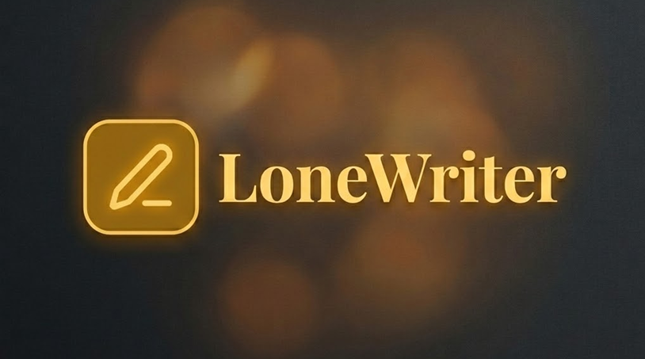

<div align="center">

*🇪🇸 [Also available in Spanish](./README_ES.md)*

</div>

# LoneWriter v1.4-multilenguaje (Stable) 🖋️

> **Your intelligent companion for writing great stories, now with advanced AI capabilities, PWA-optimized and available in multiple languages.**
>
> 🌐 **Web Access:** [lonewriter.vercel.app](https://lonewriter.vercel.app/)
>
> ☕ **Support the project:** [Buy me a coffee](https://buymeacoffee.com/sergio.snchez)

LoneWriter is a minimalist and powerful application designed for writers seeking a zen environment with cutting-edge artificial intelligence capabilities. Manage your narrative structure, create a detailed compendium of your world, and receive help from expert literary assistants, all from your browser or installed as a native application thanks to its PWA technology.

## ✨ Main Features

### 🌍 Multilingual (i18n)
- **Spanish and English:** Fully translated interface with language selector in Settings > General.
- **Persistence:** Language preference is automatically saved in `localStorage`.
- **Extensible Architecture:** i18next-based system with JSON dictionaries, ready to add more languages.

### 📖 Dynamic Narrative Structure
- **Key Hierarchy:** Organize your novel into Acts, Chapters and Scenes fluidly.
- **Zen Focus:** Clean interface designed to minimize distractions and maximize creativity.
- **Real-time Statistics:** Track your progress with word count and daily goals.
- **Responsive Design:** Interface optimized for mobile and tablets with drawer navigation, touch targets and collapsible panels.

### 🧠 Integrated AI Assistant (Oracle)
- **Multiple Models:** Support for Gemini, GPT-4o, Claude 3.5 and local models (LM Studio/Ollama).
- **Literary Tools:** Rewrite scenes, adjust tone, improve pacing or change POV with one click.
- **Compendium Smart Context:** Automatically detects entities from your lore (characters, places, objects) and integrates them into AI queries for perfect narrative coherence.
- **Debate System:** Multiple AI agents debate your scene with configurable rounds and persistent sessions.
- **Oracle Verdicts:** Paragraph-by-paragraph coherence analysis with real-time contradiction detection.
- **Selective Exclusion:** Control which Compendium entities participate in coherence analysis with one click.

### 📚 Compendium and Lore
- **Character Library:** Detailed character sheets with traits, motivations and arcs.
- **World Building:** Manage places, key objects and rules of your universe.
- **Knowledge Base:** Upload reference files (TXT, MD, CSV, JSON) for AI to use as context.

### 💾 Portability and Synchronization
- **Cloud Sync:** Native connection with **Google Drive** for automatic backups and total persistence.
- **Privacy First:** Your data is saved locally (IndexedDB) and optionally in your own Google personal space.
- **Compressed Export:** Download your complete project in compressed `.lwrt` format (unreadable as plain text) or generate a Word document (`.docx`).
- **Backward Compatibility:** The importer automatically detects old (plain JSON) and new (compressed) `.lwrt` files.

## 🛠️ Technologies

- **Core:** React + Vite
- **Database:** Dexie.js (IndexedDB)
- **i18n:** i18next + react-i18next
- **Compression:** pako (gzip)
- **PWA:** Vite PWA Plugin (Service Workers, Offline support)
- **Synchronization:** Google Drive API (GSI)
- **Deployment:** Vercel

## 🚀 Installation and Local Development

If you want to try LoneWriter in your own environment:

1. Clone the repository:
   ```bash
   git clone https://github.com/sergio-snchez/LoneWriter.git
   ```
2. Install dependencies:
   ```bash
   npm install
   ```
3. Run the development server:
   ```bash
   npm run dev
   ```

## 📜 Credits

Designed and developed with ♥ by **Sergio Sánchez** with Antigravity.

---

*LoneWriter v1.4-multilenguaje - Your personal space to bring great stories to life.*

---

<div align="center">

*🇪🇸 [Also available in Spanish](./README_ES.md)*

</div>